# Lab Report 3

## Part 1 - Bugs

### Failure-Inducing Input

The `reverseInPlace` method in the `ArrayExamples` class is buggy. 
The `testReverseInPlace2` method creates a failure-inducing input. 

```
@Test 
  public void testReverseInPlace2() {
    int[] input = { 2, 4, 5, 7, 8 };
    ArrayExamples.reverseInPlace(input);
    assertArrayEquals(new int[]{ 8, 7, 5, 4, 2 }, input);
  }
```


### Non-Failure Inducing Input

The `testReverseInPlace` in the `ArrayTests` file does not create a failure-inducing input. 

```
@Test 
  public void testReverseInPlace() {
    int[] input1 = { 3 };
    ArrayExamples.reverseInPlace(input1);
    assertArrayEquals(new int[]{ 3 }, input1);
  }
```

### Symptoms

Here is the output from running JUnit tests on the ArrayExamples class. 

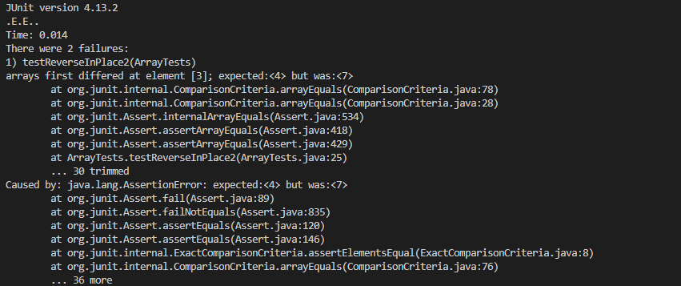

### Fixing the Bug

This is the original buggy code in the `reverseInPlace` method. 

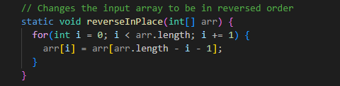

This is the fixed code. 

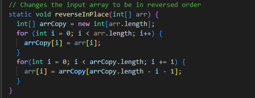

The original code directly modifies `arr`. This works well until we reach the halfway point, where we will start replacing values at the end of `arr` with values at the start. However, these values at the start were already modified, so we will get a kind of palindrome with our array values instead of reversing the order. 

The new code creates a deep copy of `arr` before updating. This way, we can reference a copy of `arr` while modifying its values. 

## Part 2 - Researching Commands

### Find Command Options

1. `find -name` option

    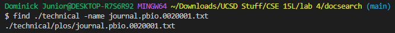 

    This command uses the `name` command to look specifically for the `journal.pbio.0020001.txt` file in the given directory.

    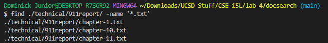

    This second example looks for any file ending in `.txt` in the given directory.

2. `find -type` option

    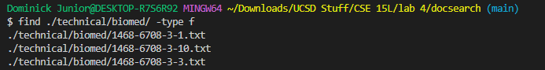
    
    This example uses the `-type` option on the `find` command. Here, use the `f` argument to specify that we are looking for **files** in the `./technical/biomed` directory.

    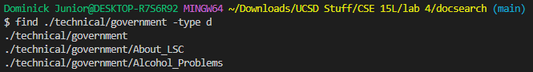

    This example uses the `d` argument with the `find` command. The `d` command is used to look for any **folders** within the given directory.

3. `find -size` option

    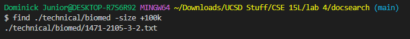

    This example uses the `-size` option to look for any files with the given file size. In this case, we give `+100k` as an argument which means we are looking for any files larger than 100 kilobytes.

    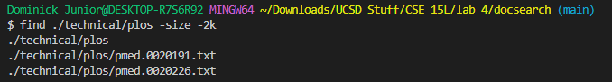

    This examples gives `-2k` as an argument to the `-size` option. This means that we are looking for any files smaller than 2 kilobytes.

4. `-delete` option 

    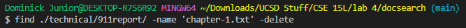

    This example uses the `-delete` option in order to delete any files matching the output of the find command. In this case, `chapter-1.txt` in the `technical/911report` directory is deleted.

    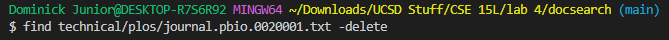 

    This is another example of using the `delete` command. In this case, the `journal.pbio.0020001.txt` file is deleted from the `technical/plos` directory.

### Sources Used

ChatGPT
    
Prompt

    What are some find command line examples

Output

1. **Find files by name:**
   ```bash
   find /path/to/search -name "filename"
   ```

2. **Find files by extension:**
   ```bash
   find /path/to/search -name "*.extension"
   ```

3. **Find directories:**
   ```bash
   find /path/to/search -type d
   ```

4. **Find files:**
   ```bash
   find /path/to/search -type f
   ```

5. **Find files modified within a certain time frame (e.g., within the last 7 days):**
   ```bash
   find /path/to/search -mtime -7
   ```

6. **Find files by size (e.g., find files greater than 1MB):**
   ```bash
   find /path/to/search -size +1M
   ```

7. **Find files and perform an action on them (e.g., delete):**
   ```bash
   find /path/to/search -name "filename" -delete
   ```

8. **Find files and execute a command on them (e.g., grep for a pattern):**
   ```bash
   find /path/to/search -name "filename" -exec grep "pattern" {} \;
   ```

9. **Find files with specific permissions:**
   ```bash
   find /path/to/search -perm 644
   ```

10. **Find empty files or directories:**
    ```bash
    find /path/to/search -empty
    ```

Remember to replace `/path/to/search`, `"filename"`, `"*.extension"`, etc., with your actual search path and criteria. And be cautious when using commands like `-delete` as they can permanently remove files. Always double-check your command before executing it, especially when dealing with deletion.

